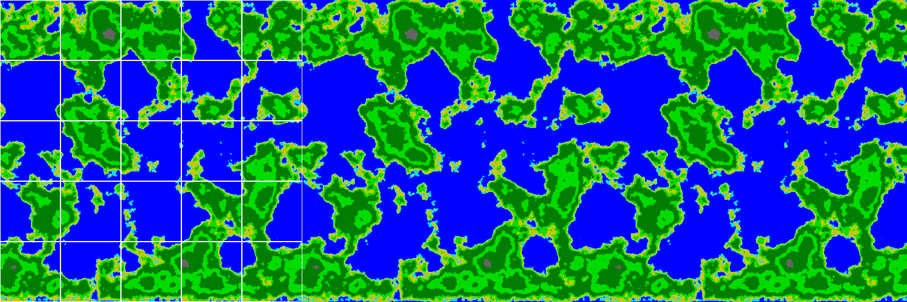
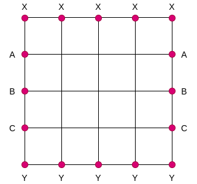
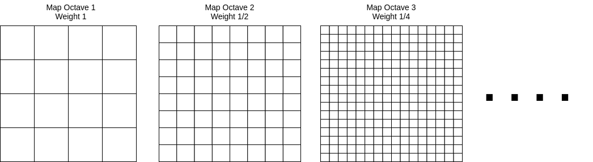

# Python Map Generator
## Description
A simple python object which generates perlin noise whos gradients wrap along the outer edges of the region.

This follows the standard perlin noise algorithm, provides functionality for applying octaves, and suppports an unbiased noise output range. For a more detailed explaination of these features, see https://eev.ee/blog/2016/05/29/perlin-noise/. **NOTE**: the code provided in this repository is an extension ontop of https://gist.github.com/eevee/26f547457522755cb1fb8739d0ea89a1

The enhancement applied here is around preloading the gradients for all tiles in a specific way. The goal is to ensure the outermost points to have matching gradients in order to give a spherical-like generation similar to a equirectangular projection.
The purpose here is to:
- generate the same gradients for all points along the x axis (see X)
- generate the same gradients for all points containing a dimension's maximum value (see Y)
- generate the same gradient for matching coordinates between the x = 0 and
  x = X_MAX planes (see A,B,C)

For example, in a (4,4) solution, we would expect there to be 5 unique gradients along the
outer edge of the perlin map (X,A,B,C,Y):

However,the octave generation in the previous implementation would end up breaking this continuity, since it simply reached out to a scaled out point on this noise, effectively layering a non-wrapping perlin map ontop of this. So to resolve this, we create child maps within this object whos tile value is x*2^n, such that x is the parent's tile value, and n is the octave index for the child map. Then, before adding each weighted octave value to the resulting noise value, we scale the point for each octave map use that.

## Original Work
Please checkout the original perlin generator from which this implementation extends:
https://gist.github.com/eevee/26f547457522755cb1fb8739d0ea89a1

Also, the owner created a well documented blog on this too, and
is very insightful: https://eev.ee/blog/2016/05/29/perlin-noise/
